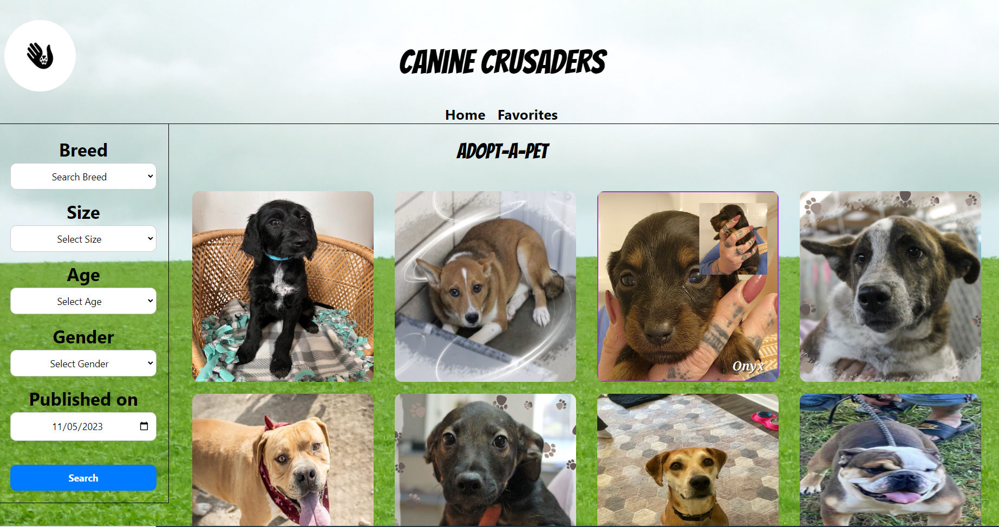
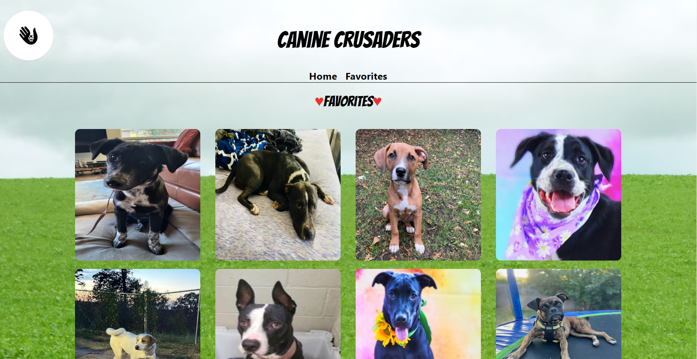

## Project Name:

```
" Come find your furry compainon, on our website "

 - Canine Cruscaders

```

## Contents

- [TEAM Members](#team-members)
- [Features](#features)
- [How to Use](#how-to-use)
- [User Story](#user-story)
- [Screenshot of the Application](#screenshot-of-the-application)
- [Technologies Used](#technologies-used)
- [Deployment](#deploy)
- [Link to Site on GitHub](#link-to-site-on-github)

## Team members:

    Holly Richard,
    Dylan Polito, &
    Barbara Cortinas

## Features

Our website offers a range of features designed to make finding your new best friend a walk in the park:

- **Comprehensive Listings**: Access a wide array of pet profiles from various adoption organizations, all in one place.
- **Advanced Filtering**: Easily find pets that match your lifestyle by filtering options such as breed, size, age, and the date they were listed for adoption.
- **Favorites**: Not ready to decide? Save and manage your favorite furry friends on your personalized favorites page for easy access.
- **Mobile-First Design**: Whether you’re on the go or at home, our website is fully responsive and optimized for mobile devices, ensuring a seamless experience across all platforms.
- **User-Friendly Interface**: A clean and intuitive interface allows you to navigate our site with ease, focusing on what’s important - finding your future pet.

## How to Use

1. **Search for Pets**: Visit our home page and start your search. You can view all available pets or use the filter options to narrow down your search.
2. **Save Favorites**: Found pets you're interested in? Click on the heart icon to add them to your favorites. You can access your favorites by navigating to the 'Favorites' page in the menu.
3. **Learn More**: To get more information about a pet, click on their profile. There you'll find more details and the next steps to take for adoption.
4. **Mobile Access**: For the best mobile experience, navigate to our website using your mobile browser. Our responsive design will ensure you have a full-featured experience tailored to your device.

### User-Story

As a pet lover,
I want to see a list of available pets for adoption,
So that I can browse through different options and choose a pet that resonates with me.

## Screenshot of the Application





## Technologies Used

- HTML
- CSS
- JavaScript
- Api : PetFinder API, and Dogs API - API Ninjas
- Tailwind CSS
- Jquery
- Flowbite
- DAYJS()
- Google Fonts

## Deploy

- [CanineCrusaders.com]()

## Link to Site on GitHub

[Canine Crucaders](https://github.com/YeeHolls/Canine-Crusaders)
